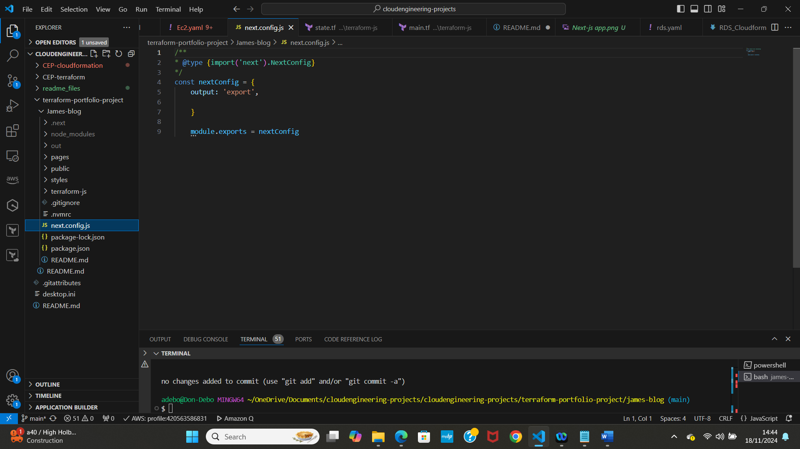
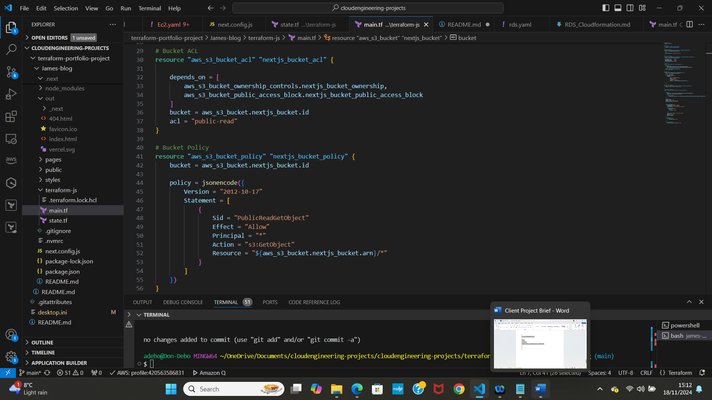

<<<<<<< HEAD
# terraform-portfolio-project
This is a Next.js portfolio website on AWS using Infrastructure as Code (IaC) principles with Terraform. This project will give you hands-on experience with Terraform, S3, and CloudFront, mimicking a real-world deployment scenario.

# Client Project Brief
Portfolio Project - Terraform
Scenario Overview
Client: James Smith, a freelance web designer

# Project: Portfolio Website Deployment

Project Description:  James Smith, a freelance web designer, wants to showcase his work and attract potential clients through an online portfolio. He has designed a modern, responsive single-page website using the Next.js framework. James requires this website to be hosted on a robust, scalable, and cost-effective platform. Additionally, the website needs to be highly available and deliver fast loading times for a global audience.

My Role: As a team of cloud engineers, My task is to deploy James's Next.js portfolio website on AWS using Infrastructure as Code (IaC) principles with Terraform. This project will give me hands-on experience with Terraform, S3, and CloudFront, mimicking a real-world deployment scenario.

# Problem Statement
James needs his portfolio website to be:

Highly Available: The website should be accessible to users worldwide with minimal downtime.
Scalable: As his portfolio gains traction, the hosting solution should handle increased traffic without performance degradation.
Cost-Effective: Hosting costs should be optimized, avoiding unnecessary expenses.
Fast Loading: The website should load quickly for visitors, providing a seamless user experience.
Given these requirements, deploying the website using AWS services such as S3 for static hosting and CloudFront for content delivery is an ideal solution. Using Terraform will allow you to automate and manage the infrastructure efficiently.

# Project Outcome
By the end of this project, I should have:

Deployed a Next.js Website: Successfully deployed the Next.js portfolio site on AWS.
Implemented Infrastructure as Code: Used Terraform to automate the creation of AWS resources.
Configured Global Content Delivery: Set up AWS CloudFront to deliver the website content globally with low latency.
Ensured Security and Performance: Applied best practices for security and performance, ensuring a fast and secure website for James's portfolio.
Deploy everything to GitHub: Create a GitHub repo and host all your project files and code there.
Here is the Architecture designed for you:

# Next Steps
With this understanding of Next.js, you're ready to start the application preparation. In the next part of our lesson, you will:

Create a GitHub repository for your project.
Clone the Next.js portfolio starter kit.
Record a Loom video explaining the code structure and add the link to your README file.
These steps will set the stage for deploying your Next.js application on AWS using Terraform. Let's get started!

# Prepare the next.js application

# 1. Create a GitHub Repository
Create a New GitHub Repository:

Go to GitHub and create a new repository named terraform-portfolio-project.
Initialize the repository with a README file.
# 2. Clone the Repository:

 git clone https://github.com/<your-username>/terraform-portfolio-project.git
 cd terraform-portfolio-project

# 3. Clone the Next.js Portfolio Starter Kit
Clone the Portfolio Starter Kit:

npx create-next-app@latest nextjs-blog --use-npm --example "https://github.com/vercel/next-learn/tree/main/basics/learn-starter"

# 4. Navigate to the Project Directory:

* Create a new file inside the nextjs-blog(James-blog) carpet that was recently created and is now visible in VS Code and name it “next.config.js”

* Write the following code inside:

cd james-blog

npm run dev
This should start your next.js app on http://localhost:3000/

Running on localhost means that we are just running this application locally on our machine.

# 5. Create an export for our build

Run: “npm run build” on VS code

This will create an “out” folder inside of our nextjs-blog on next.js application

It will be the “out” folder that we will be using to deploy it to amazon S3.

# 6. Create a new file inside our nextjs-blog directory

i) mkdir terraform-js

ii) cd terraform-js

# 7. Create a S3 bucket

Run the following command on VS code:

aws s3api create-bucket — bucket aa-my-tf-website-state — region eu-west-2 — create-bucket-configuration LocationConstraint=eu-west-2

I’ve named my bucket “aa-my-tf-website-state" and choose eu-west-2 as region. Remember to choose a unique s3 bucket name and the region that is closest to you.

# 8.Create a DynamoDB table

Run the following command on VS code:

aws dynamodb create-table \
    --table-name my-db-website-table \
    --attribute-definitions AttributeName=LockID,AttributeType=S \
    --key-schema AttributeName=LockID,KeyType=HASH \
    --provisioned-throughput ReadCapacityUnits=1,WriteCapacityUnits=1

I’ve specified my table name as “my-db-website-table”. Pick a name for your table.

# 9. Create state file

i) Inside “terraform-js” folder create a new file and name it “state.tf”

ii) Here we are going to setup our terraform state with S3 and DynamoDB

* You can name your bucket and DynamoDb table whatever you want, but do remember to use the region that is closest to you.

10. Create a main file

i) Inside “terraform-js” folder create a new file and name it “main.tf”

ii) Choose the provider

The provider tells terraform which cloud provider and region to use for provisioning our resources.

iii) Create a S3 bucket

This bucket will store the static files for our next.js application

I named it “nextjs-portfolio-bucket-ad”

iv) Set Ownership controls

This is done to assure that the bucket owner, in this case us, have total control of the objects in the bucket.

Enables us to have total control of all the objects stored in our bucket.

With “bucket = aws_s3_bucket.nextjs_bucket.id” we specify the bucket we want to be part of this ownership.

v) Allow public access to our S3 bucket

This configuration disables the public access block settings that prevent any public access.

Setting them to false ensures that the bucket and the content inside the bucket can be publicly accessible.

vi) Bucket ACL

Now we need to set the bucket ACL to public read so the objects in the bucket can also be publicly accessible.

This resource sets the acl (access control list) to public read, which allows everyone to read the objects inside our bucket.

The “depends on” tells which resources are the acl depending on. In this case the ones ownership control and public access.

It also ensures that the ownership controls and the public access block settings are applied before setting the acl.

vii) Attach a bucket policy

The purpose of the bucket policy is to define detailed access permissions for the bucket and its objects using IAM policy.

=======
>>>>>>> 89cbdbd7c29c6e66432a0b98ad864781d390424e

