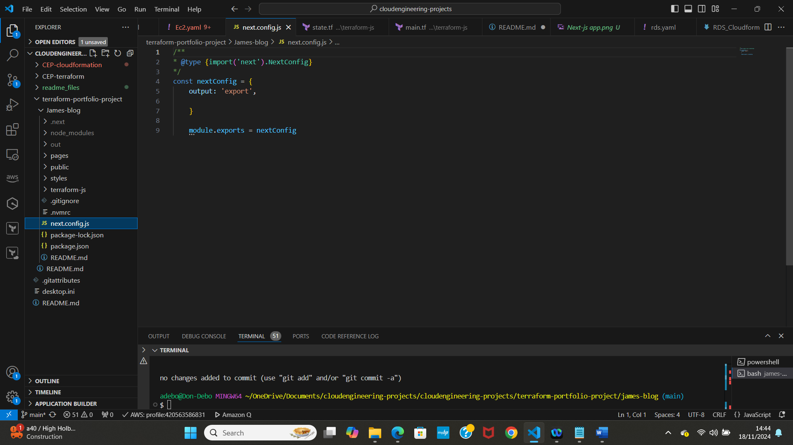
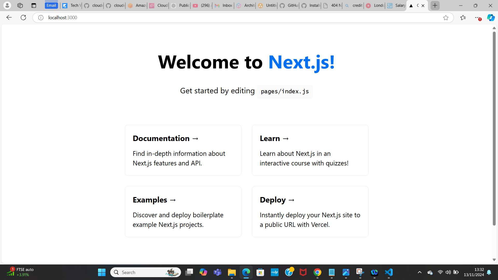
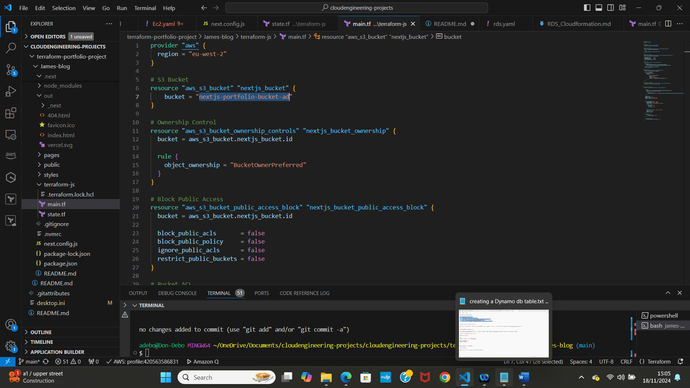
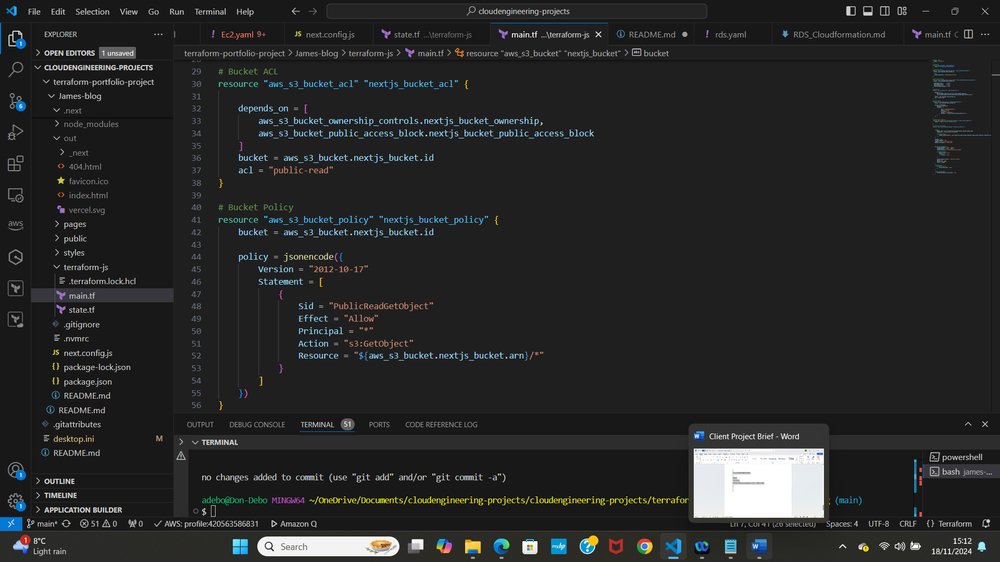
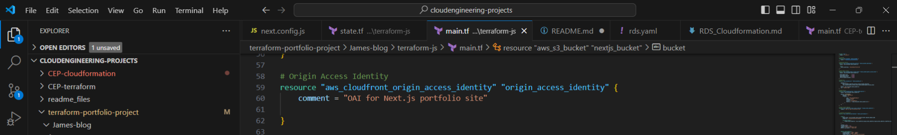
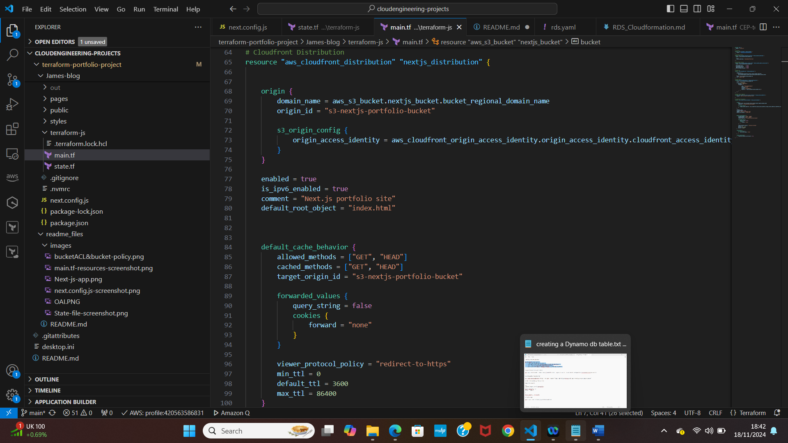
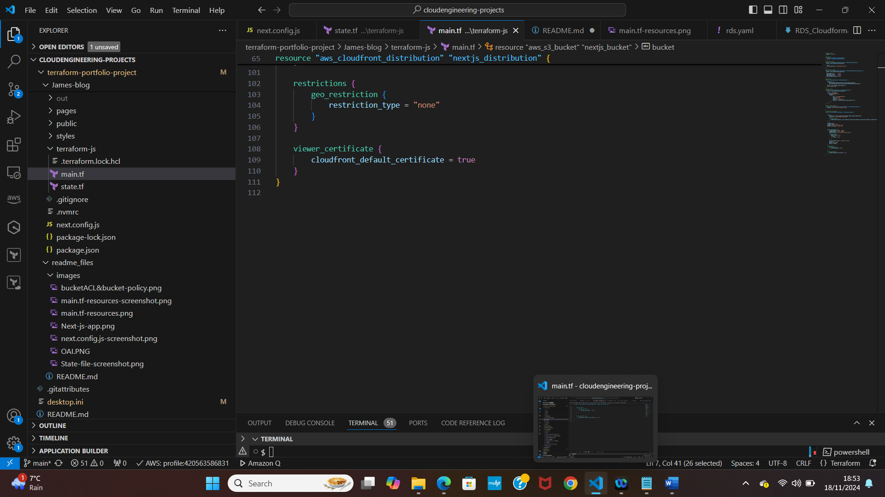
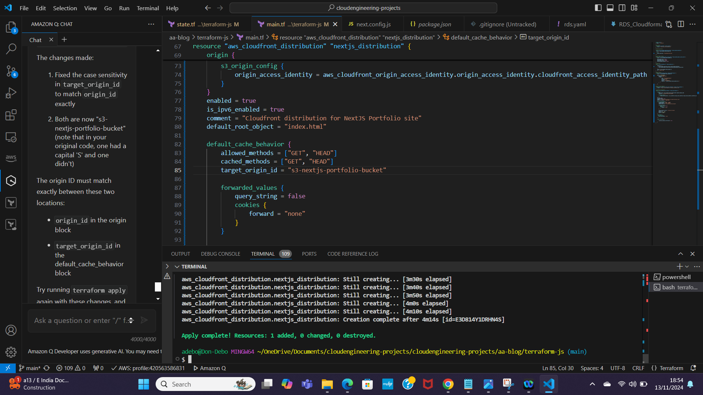
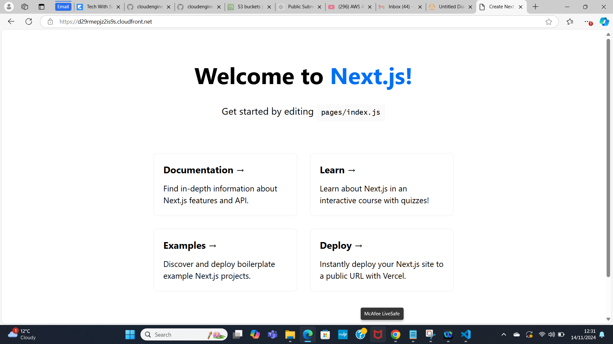

# terraform-portfolio-project
This is a Next.js portfolio website on AWS using Infrastructure as Code (IaC) principles with Terraform. This project will give you hands-on experience with Terraform, S3, and CloudFront, mimicking a real-world deployment scenario.

# Client Project Brief
Portfolio Project - Terraform
Scenario Overview
Client: James Smith, a freelance web designer

# Project: Portfolio Website Deployment
Project Description:  James Smith, a freelance web designer, wants to showcase his work and attract potential clients through an online portfolio. He has designed a modern, responsive single-page website using the Next.js framework. James requires this website to be hosted on a robust, scalable, and cost-effective platform. Additionally, the website needs to be highly available and deliver fast loading times for a global audience.

My Role: As a team of cloud engineers, My task is to deploy James's Next.js portfolio website on AWS using Infrastructure as Code (IaC) principles with Terraform. This project will give me hands-on experience with Terraform, S3, and CloudFront, mimicking a real-world deployment scenario.

# Problem Statement
James needs his portfolio website to be:

Highly Available: The website should be accessible to users worldwide with minimal downtime.
Scalable: As his portfolio gains traction, the hosting solution should handle increased traffic without performance degradation.
Cost-Effective: Hosting costs should be optimized, avoiding unnecessary expenses.
Fast Loading: The website should load quickly for visitors, providing a seamless user experience.
Given these requirements, deploying the website using AWS services such as S3 for static hosting and CloudFront for content delivery is an ideal solution. Using Terraform will allow you to automate and manage the infrastructure efficiently.

# Project Outcome
By the end of this project, I should have:

Deployed a Next.js Website: Successfully deployed the Next.js portfolio site on AWS.
Implemented Infrastructure as Code: Used Terraform to automate the creation of AWS resources.
Configured Global Content Delivery: Set up AWS CloudFront to deliver the website content globally with low latency.
Ensured Security and Performance: Applied best practices for security and performance, ensuring a fast and secure website for James's portfolio.
Deploy everything to GitHub: Create a GitHub repo and host all your project files and code there.
Here is the Architecture designed for you:

# Next Steps
With this understanding of Next.js, you're ready to start the application preparation. In the next part of our lesson, you will:

Create a GitHub repository for your project.
Clone the Next.js portfolio starter kit.
Record a Loom video explaining the code structure and add the link to your README file.
These steps will set the stage for deploying your Next.js application on AWS using Terraform. Let's get started!

# Prepare the next.js application

# 1. Create a GitHub Repository
Create a New GitHub Repository:

Go to GitHub and create a new repository named terraform-portfolio-project.
Initialize the repository with a README.md file.
# 2. Clone the Repository:

 git clone https://github.com/<your-username>/terraform-portfolio-project.git
 cd terraform-portfolio-project

# 3. Clone the Next.js Portfolio Starter Kit
Clone the Portfolio Starter Kit:

npx create-next-app@latest nextjs-blog --use-npm --example "https://github.com/vercel/next-learn/tree/main/basics/learn-starter"

# 4. Navigate to the Project Directory:

* Create a new file inside the nextjs-blog(James-blog) carpet that was recently created and is now visible in VS Code and name it “next.config.js”

* Write the following code inside:

cd james-blog

npm run dev
This should start your next.js app on http://localhost:3000/

Running on localhost means that we are just running this application locally on our machine.

# 5. Create an export for our build

Run: “npm run build” on VS code

This will create an “out” folder inside of our nextjs-blog on next.js application

It will be the “out” folder that we will be using to deploy it to amazon S3.

# 6. Create a new file inside our nextjs-blog directory

i) mkdir terraform-js

ii) cd terraform-js

# 7. Create a S3 bucket

Run the following command on VS code:

aws s3api create-bucket — bucket aa-my-tf-website-state — region eu-west-2 — create-bucket-configuration LocationConstraint=eu-west-2

I’ve named my bucket “aa-my-tf-website-state" and choose eu-west-2 as region. Remember to choose a unique s3 bucket name and the region that is closest to you.

# 8.Create a DynamoDB table

Run the following command on VS code:

aws dynamodb create-table \
    --table-name my-db-website-table \
    --attribute-definitions AttributeName=LockID,AttributeType=S \
    --key-schema AttributeName=LockID,KeyType=HASH \
    --provisioned-throughput ReadCapacityUnits=1,WriteCapacityUnits=1

I’ve specified my table name as “my-db-website-table”. Pick a name for your table.

# 9. Create state file

i) Inside “terraform-js” folder create a new file and name it “state.tf”

ii) Here we are going to setup our terraform state with S3 and DynamoDB

* You can name your bucket and DynamoDb table whatever you want, but do remember to use the region that is closest to you.

10. Create a main file

i) Inside “terraform-js” folder create a new file and name it “main.tf”

ii) Choose the provider

The provider tells terraform which cloud provider and region to use for provisioning our resources.

iii) Create a S3 bucket

This bucket will store the static files for our next.js application

I named it “nextjs-portfolio-bucket-ad”

iv) Set Ownership controls

This is done to assure that the bucket owner, in this case us, have total control of the objects in the bucket.

Enables us to have total control of all the objects stored in our bucket.

With “bucket = aws_s3_bucket.nextjs_bucket.id” we specify the bucket we want to be part of this ownership.

v) Allow public access to our S3 bucket

This configuration disables the public access block settings that prevent any public access.

Setting them to false ensures that the bucket and the content inside the bucket can be publicly accessible.

vi) Bucket ACL

Now we need to set the bucket ACL to public read so the objects in the bucket can also be publicly accessible.

This resource sets the acl (access control list) to public read, which allows everyone to read the objects inside our bucket.

The “depends on” tells which resources are the acl depending on. In this case the ones ownership control and public access.

It also ensures that the ownership controls and the public access block settings are applied before setting the acl.

vii) Attach a bucket policy

The purpose of the bucket policy is to define detailed access permissions for the bucket and its objects using IAM policy.

=======
This policy allows public-read access to the object in S3.

viii) Setup CloudFront service to serve our static website from S3

This will serve static content from S3 through CloudFront.

ix) Define Origin Access Identity (OAI)

This is a special CloudFront user that gives CloudFront access to our S3 bucket so that we can serve the next.js application.

By using OAI we ensure that only CloudFront can directly access our S3 bucket.

x) Define CloudFront Distribution

# A. As usual we start with the resource and I named it “nextjs_distribution”.

The resource “aws_cloudfront_distribution” is the resource that will configure our cloudfront distribution, which serves the content delivery network to distribute our next.js application stored in S3.

# B. The Origin block (lines 68–70) specifies the origin settings for our CloudFront distribution.

We specified the origin with a domain name with:

· Our S3 bucket and we add a regional domain name.

· Add an origin_id (It’s a unique identifier for our configuration and helps to uniquely identifying this origin within the CloudFront distribution.

The domain name “aws_s3_bucket.nextjs_bucket.bucket_regional_domain_name” tells CloudFront where to fetch the content from, in this case the bucket we have created before and specified at this moment.

# C. Then we have the S3 origin config block which contains settings specific to S3 as the origin.

“origin_access_identity” specifies the OAI that CloudFront uses to access the S3 bucket. So we used the resource and resource name used when creating the OAI and then specify a path for it “cloudfront_access_identity_path”.

This ensures that only CloudFront can access the content inside of our S3 bucket, which of course, adds an extra layer of security.

To summerize, the purpose of this block (lines 65–75) is for setting up CloudFront to work with our S3 bucket, and by specifying the origin settings we direct CloudFront to fetch from the S3 bucket. The S3 origin config ensures that the content is securely accessed using the OAI, preventing direct access to S3 bucket from outside of CloudFront.

This way, no one will be able to access the S3 bucket and our content apart from this CloudFront distribution using the OAI that we have defined.

# D. Configure additional settings for the CloudFront Distribution

These additional settings are important for enabling and optimizing distribution for our next.js portfolio website.

Enabled set to true means that the CloudFront distribution is active and will serve content as soon as it is deployed.

“is_ipv6_enabled” is set to true, which also enables connections with ipv6 (and not only ipv4) to access our CloudFront distribution.

“default_root_object” specifies the default root object for our distribution which in our case is our index.html file. This index.html file is being generated from the next.js build that we created from the “out” folder.

# E. Enable caching behaviour

This will define how CloudFront should handle the caching for the requests to our origin, in our case, our S3 bucket.

“allowed_methods” specify the http methods allowed for our caching behaviour. Here we are saying that we are allowing the “GET”, the “HEAD” and the “OPTIONS” requests which are typical requests for retrieving any resources.

“cached_methods” specify the http methods to actually cache. So, we are saying we are allowing the methods “GET”, “HEAD” and “OPTIONS”, but we just want to cache the “GET” and “HEAD” requests. By caching the “GET” and “HEAD” requests we make sure that these common retrieval requests are serve quickly from the cache.

“target_origin_id” links the cache behaviour to the our specified origin, in our case, our S3 bucket. This ensures that requests matching this behaviour are directed to our S3 bucket.

# F. “forward_values”

Inside the forward values we have the “query_string” which indicates where to forward the query strings to the origin. Setting this to false means that query strings are not forwarded, which simplifies our caching and also improves our performance.

“cookies” specifies how cookies should be forward to our S3 bucket or origin. Setting it to none ensures that cookies are not forward, which can improve again caching efficiency and our reduces our complexity.

“viewer_protocol_policy” ensures that viewers are redirected to https. This policy, of course, improves our security by ensuring all communication between the client and our CloudFront CDN are secured and encrypted.

“min_ttl” is the minimum amount of time an object is cached. Setting this to zero allows for immediate updates if needed.

“default_ttl” is the default amount of time an object is cached. Here is set to 3600 seconds (1 hour).

“max_ttl” is the maximum amount of time an object is time. Setting this to 86400 seconds (24 hours) ensures that the content is refreshed at least once a day.

# G. Restrictions

With restrictions we can configure geographic restrictions for the CloudFront distribution. This determines from which locations users can access our content. Since we want everyone to access our content, we will put the restrictions as none.

# H. Viewer Certificate

“viewer_certificate” configure the SSL and TLS settings for our CloudFront distribution which ensures secure communication between our users and CloudFront.

# xi. Run terraform commands

Go back to VS code and make sure you are in the “terraform-js” folder

A) Run: terraform init

This will initialize our backend.

B) Run: terraform plan

This will give us the plan of what we want to deploy.

C) Run: terraform apply

Enter the value “yes” when it asks you if you want to perform these actions.

D) Run: terraform show

We do this to see the AWS CloudFront distribution URL. Then copy the domain name in my case it is "d29rmepjz2is9s.cloudfront.net/"

# xii. Deploy the “out” folder

a) Now we deploy our “out” which is actually our nextjs folder into our S3 bucket

b) Change directory to the nextjs-blog directory: cd ..

c) Upload nextjs to the S3 bucket

Run: aws s3 sync ./out s3://s3-nextjs-portfolio-bucket-st

“s3-nextjs-portfolio-bucket-st” is the S3 bucket name we specified in our main terraform file

xiii. Check if you can see the nextjs application

a) Use the domain name you copied before. In my case is: “d29rmepjz2is9s.cloudfront.net/”

You should see the nextjs application that we just deploy to S3 through CloudFront:

# xiv. Push the code to your GitHub repository

a) git init

b) git add .

c) git commit -m “Next.js portfolio starter kit”

d) git remote add origin https://github.com/<your-username>/terraform-portfolio-project.git

e) git push -u origin master

# xv. Destroy the stack

a) Run: terraform destroy